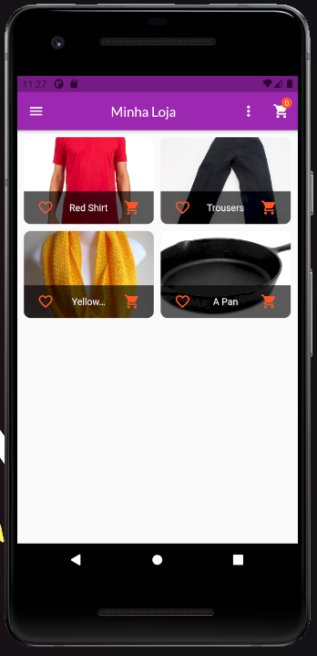
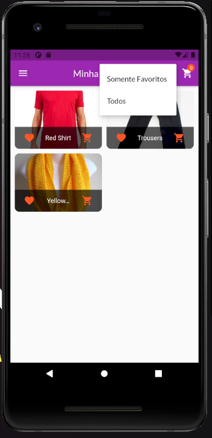
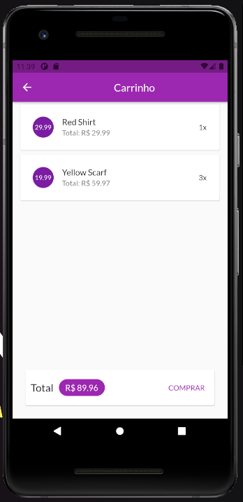
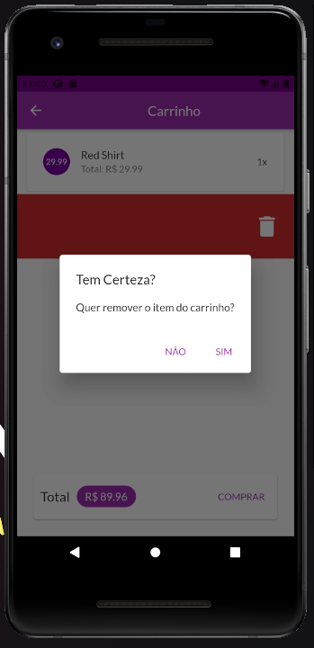
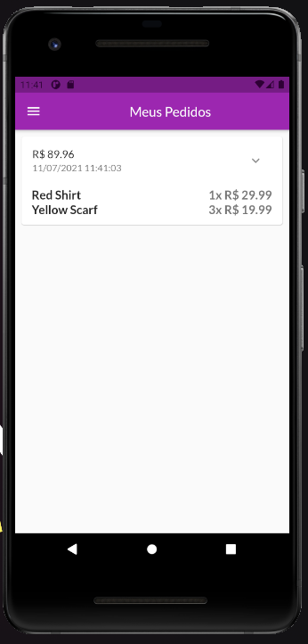
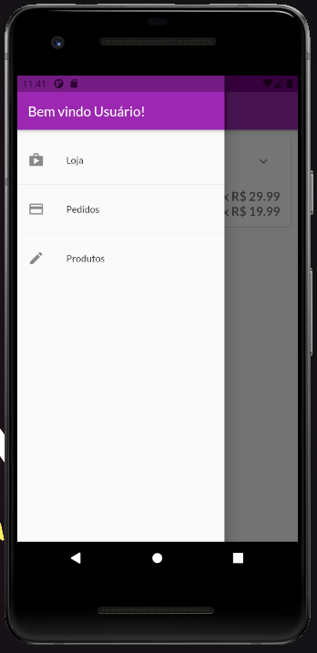
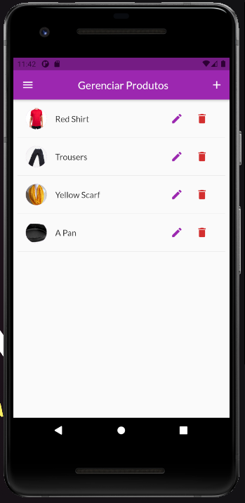
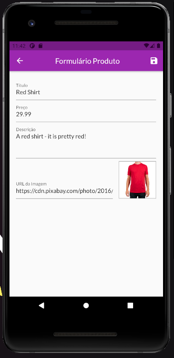

# Shop App

## Tabela de Conteúdos

- [Sobre](#about)
- [Preview do projeto](#preview)
- [Pre_requisitos](#install)

## Sobre 

App desenvolvido para fins de teste e de diversão usando todo o conceito de gerênciamento de estado interno e
externo do flutter, além de estar muito bem componentizado e otimizado para não despediçar memória.

## Preview do projeto 

### Prerequisitos necessários 

Alguns dos pré-requisitos necessários para testar o projeto.

- Emulador do Android Studio instalado e rodando.
- Dart command line.
- Flutter command line e extensão do VSCode.
